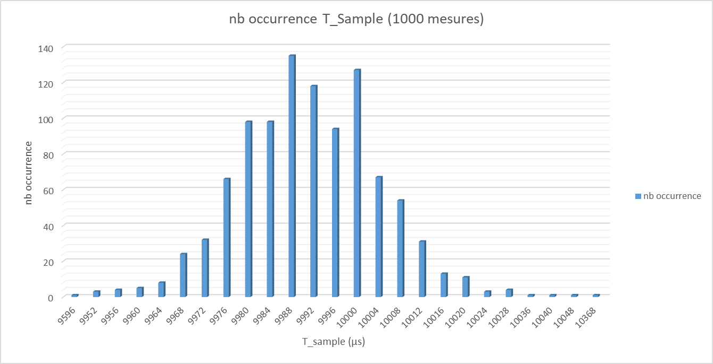

# Fréquence d'échantillonnage du gyroscope - 2

## Expérience

Dans la première expérience, on a été amené à corriger une erreur conséquente du code de l'objet Gyro. Après correction et implémentation de l'horodatage des données lors de la réception par la carte Arduino Embarquée *(i.e. quasiment au moment de l'acquisition)*, on décide de renouveller l'expérience afin de vérifier la validité de la correction et le respect des fréquences d'échantillonnage théoriques.


### Objectif

On souhaite vérifier que la période d'échantillonnage du DMP est conforme à la valeur indiquée dans la documentation du code libre de la bibliothèque mpu5060.

Pour aller plus vite, on réutilise le code intégral de la maquette déjà implémenté, sans alimenter les moteurs, en ajoutant le timestamp des données à la trame envoyée par la carte de commande embarquée, et aux données écrites dans le fichier texte.


### Protocole


1. On effectue une acquisition du gyroscope en utilisant les programmes complets du GUI et de la carte Arduino pour une fréquence d'échantillonnage connue : f=100Hz

2. On enregistre les données dans un fichier texte

3. On évalue la distribution des périodes d'échantillonnages mesurées, correspondant à la durée entre deux réceptions de données provenant du DMP, sur une base de 1000


### Résultats

*Premières entrées des données réceptionnées brutes :*

```
+---------------------------------+
|t (µs)  |roll (deg)|T_sample (µs)|
+---------------------------------+
|46001132|1,6000061 |             |
+---------------------------------+
|46011116|1,6000061 |9984,000     |
+---------------------------------+
|46021116|1,6000061 |10000,000    |
+---------------------------------+
|46031096|1,6000061 |9980,000     |
+---------------------------------+
|46041104|1,6000061 |10008,000    |
+---------------------------------+
|46051076|1,6100006 |9972,000     |
+---------------------------------+
```

-------------

*Quelques occurences des périodes d'échantillonnages :*

```
+---------------------------+
|T_sample (µs)|nb occurrence|
+---------------------------+
|9984         |98           |
|9988         |135          |
|9992         |118          |
|9996         |94           |
|10000        |127          |
|10004        |67           |
+---------------------------+
|Total        |1000         |
+---------------------------+
|T_sample moy |9991,248     |
+---------------------------+
|F sample moy |100,0875967  |
+---------------------------+
```

-------------

*Graphique :*



-------------

On observe que la distribution n'est que peu étalée autour de la période d'échantillonnage théorique. 

Sans réaliser le même protocole sur les autres fréquences d'échantillonnage, ce qui donnerait des résultats similaires, on peut valider la correction de l'erreur citée précedemment et vérifier sans problème la cohérence entre la fréquence théorique annoncée dans le header de la classe mpu5060 et la fréquence expérimentalement mesurée.


## Conclusions

Cette deuxième expérience a été concluante pour valider la valeur théorique de la période d'échantillonnage du DMP.

Plus généralement, puisque les programmes employés pour réaliser cette expérience sont les programmes implémentés dans le fonctionnement normal de la maquette, on peut assurer que la période d'échantillonnage de la boucle d'asservissement totale est entièrement imposée par la centrale inertielle. 

-------------

La période d'échantillonnage de la boucle d'asservissement est donc fixe et égale à 10ms. On peut réduire encore à 5ms, au risque d'avoir des données plus bruitées.

On fera l'hypothèse indispensable que la période d'échantillonnage choisie est suffisamment faible par rapport aux variations de l'état du système, afin de pouvoir modéliser la maquette comme un système continu et utiliser tous les outils introduits à cette occasion *(transformation de Laplace, schéma-blocs, outils de simulation type XCos)*.

-------------

Finalement, en vue de l'apparente synchronisation de l'interface graphique et de la maquette réelle, sensiblement visible lors du fonctionnement normal de la maquette, on fera l'hypothèse que les temps de propagation entre la centrale inertielle et la carte Arduino, et entre cette dernière et le programme GUI, sont négligeables. 

Proposer un protocole d'évaluation de ces temps de propagation serait envisageable, mais non indispensable en vertu du bon fonctionnement de la maquette.