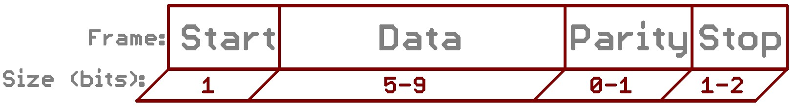

# Communication série Arduino-Processing

## Objectifs de l’interconnexion Arduino – Processing

Dans le cadre du développement d’une maquette modélisant un drone quadrirotor en rotation autour de son axe de roulis, j’ai décidé de connecter la carte de programmation Arduino, matérialisant le système de commande embarqué, à une interface graphique codée à l’aide de l’IDE Processing.

Les objectifs de cette interconnexion sont les suivants :

- Communication des paramètres de l’expérience (coefficients du correcteur PID, poussée des moteurs à l’équilibre, limitation en poussée des moteurs)

- Retour graphique pour l’utilisateur de la maquette (animation en temps réel d’un modèle 3d de l’avion à l’aide d’OpenGL et de ToxicLib)

- Enregistrement des résultats de l’expérience sur l’ordinateur

## L’interface série

[source sparkfun](https://learn.sparkfun.com/tutorials/serial-communication)

### Description

Pour permettre aux différents composants d’un système automatisé de communiquer entre-eux, ceux-ci doivent s’accorder sur un même protocole de communication. A l’instar d’une conversation entre deux individus, la syntaxe des messages doit être connue par les deux interlocuteurs. Le protocole série en est un, très répandu en programmation embarquée.

### Taux de transfert

L’un des paramètres d’une communication série est le taux de transfert de données en bits par seconde (baud rate). Les vitesses des deux appareils doivent correspondre. De plus, la vitesse effective est plus basse que la vitesse de transmission choisie compte tenu de la parité et des bits d’arrêt choisis.

### Parité

Il s’agit d’un bit qui permet un contrôle de la cohérence des données, très simple, assez peu utilisé, qui représente la parité de la somme des bits de données. Cela ralentit de façon conséquente l’échange série, car le récepteur doit être capable de détecter les erreurs et commander un nouvel envoi de la trame.

### Bits d’arrêt

Ils sont envoyés à la fin de chaque paquet de bits afin de permettre au récepteur de détecter la fin de l’envoi et de rester synchronisé avec le flot de données.

### Port Serial Arduino

Les vitesses usuelles sont 9600 bits/s et 115200 bits/s. Il n’y a pas de bit de parité, un bit de départ et un bit d’arrêt par défaut, et les paquets de bits sont des octets (8 bits).

## Les étapes de la transmission de données

### Conception de la trame

Le transfert de données via le protocole série s’effectue sous la forme de byte. Un byte (ou octet) contient 8 bits. On peut utiliser le type de données char qui est un byte (caractères alphanumériques codés en UTF-8, indices 0-255).

Comme les données à transmettre sont de type byte (ex : state, start, end) mais aussi de type float (ex : roll, throttles), il a fallu choisir un moyen de convertir les float en bytes et inversement.

Un problème qui apparait est la représentation des nombres, particulièrement des flottants, dans deux systèmes d'exploitation différents. En général, rien ne garantit que ceux-ci adoptent la même représentation, sur un nombre identique de bits. Il a donc fallu trouver un moyen pour accorder ces représentations, en ayant en tête de minimiser la taille de la trame pour accélérer la communication.

Dans le cas des commandes moteur, les données sont comprises dans l’intervalle [0,100]. Deux bytes peuvent coder un uint (entier non signé) de l’intervalle [0,65535]. On décide donc de conserver deux décimales pour chaque float. Lors de l’envoi, le flottant est multiplié par 100 et converti en entier. Les opérateurs binaires des langages C++ (Arduino) et Java (Processing) permettent de découper l’entier en deux bytes. Lors de la réception, les opérateurs binaires restituent l’entier complet. Il suffit alors de diviser par 100 afin de récupérer le flottant correspondant. 

Dans le cas de l’angle de roulis, les données sont comprises dans l’intervalle [-180,180]. Différents choix peuvent être effectués : choisir dès l’acquisition des données gyro l’intervalle [0,2PI] ou [0,360] ; conserver l’intervalle [-PI,PI] ou [-180,180].

Pour conserver le même protocole que le précédent, la solution retenue est de récupérer lors de l’acquisition l’angle dans un intervalle [-180,180] (plus pratique pour la commande), et de décaler l’intervalle lors de l’envoi sous la forme [0,360]. En décalant à nouveau lors de la réception, on aura alors des données avec une précision au centième de degré. (A COMPARER AVEC LA PRECISION DU CAPTEUR)

Il est possible pour diverses raisons (notamment si le buffer est surchargé), qu’il y ait un décalage dans l’ordre d’envoi ou de réception des paquets (relativement rare). D’où la précaution suivante : on ajoute un compteur indiquant la position de lecture d'une trame en cours de réception, que l’on synchronise à l’aide de paquets supplémentaires indiquant le début et la fin de la trame.

*TODO : schéma de la trame processing et de la trame arduino*

### Réception des données

Quand un interlocuteur série reçoit des données, le port série lance un évènement attrapé par le programme local. Il est alors possible de lire le buffer contenant les paquets disponibles, tout en sachant si une trame commence ou se termine. Si une trame se termine, un nouvel évenement propre au programme est lancé afin de signaler que la totalité des variables d'état sont à actualiser avec les données entrantes intègres.

### Envoi des données

Quand le gyroscope est prêt à envoyer sa propre trame de données, un évènement est envoyé et attrapé par le programme embarqué. Dans ce cas, la nouvelle commande à envoyer aux moteurs est calculée, et l’envoi de la trame vers l'interface utilisateur s’effectue.

De même, quand l’utilisateur impose un nouvel état de la maquette ou change les paramètres de l’expérience, un évènement similaire est envoyé, signalant au programme local d’effectuer le transfert de la trame correspondant.

### Envoi données Processing -> fichier Log

Afin de récupérer toutes les données reçues par Processing, en vue d’étudier le bon fonctionnement de la maquette et la détermination des performances en boucle fermée,  on implémente en parallèle du protocole Arduino <-> Processing, un enregistrement des données dans un fichier texte. On utilise pour cela l’objet Processing « PrintWriter » qui s’occupe de gérer cette fonctionnalité. 

*TODO ...*

## Calcul des temps de transfert

### Objectifs

On souhaite calculer précisément le temps de transfert de données via le protocole de communication décrit précédemment. Le protocole complet dans un sens implique : la préparation du paquet (choix des floats / int, conversion en byte), l’envoi du paquet, la réception du paquet, le traitement du paquet (reconversion). On rappelle que chaque paquet de données comprend un byte de début et un byte de fin.

### Synthèse des différents résultats