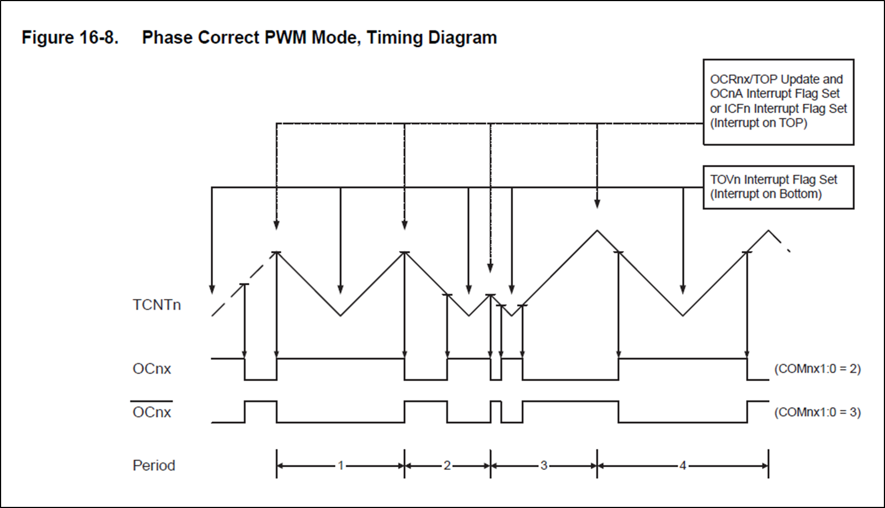
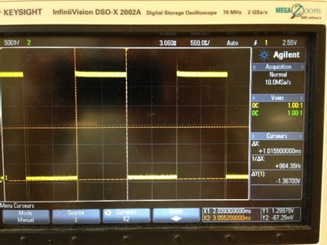
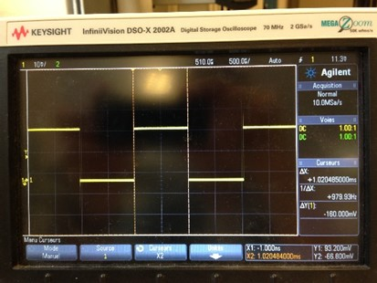

# Programmation de la génération d'un signal créneau à rapport cyclique variable

## Objectif de l'expérience

Afin de faire fonctionner les moteurs, il faut être capable de générer le signal de commande approprié.

Le moteur est asservi en vitesse de rotation. La consigne, en pourcentage de vitesse maximale, est envoyé aux variateurs de vitesse sous la forme d'un signal modulé en rapport cyclique (pulse width modulation PWM).

La documentation technique des moteurs indique le cahier des exigences devant être respecté par le signal : 

-	Signal de type Pulse
-	Fréquence  ̴50Hz (standard PWM) ou   ̴490 Hz (fast PWM)
-	Période de pulsation comprise entre   ̴1ms et   ̴2ms.

**Objectif :** Vérifier si l’allure des signaux PWM générés par la carte Arduino respectent les exigences des variateurs de vitesse (ESC) des moteurs brushless.

## Méthode de génération de signal PWM :

### Arduino

-	2 Timers (Timer1 : 16 bits ; Timer2 : 8bits)
-	Synchronisation avec l’horloge interne (16MHz)
-	Diminution de la fréquence d’entrée des compteurs grâce au Prescaler
-	Mode de génération de signal choisi : phase-correct pwm (incrémentation puis décrémentation, passage du compteur à la valeur-paramètre déclenche le signal bas)
-	Réglage des paramètres via constantes de registres (IDE Arduino – processeur Atmel)

(Plus d'explications ...)

### Variante : proposition de montage électronique

## Protocole expérimental

-	Visualisation des signaux générés par chacun des timers à l’oscilloscope
-	Mesure de la fréquence
-	Mesure de la période de signal bas pour des ratios allant de 0% à 100%
-	Comparaison avec les exigences de l’ESC

### Montage

 

## Résultats

*La précision des résultats pour les différentes périodes mesurées est égale à 0.01ms : mesure sur l’oscilloscope à l’aide de curseurs, en prenant en compte le régime transitoire du signal.*

### Premier essai Timer1 : échec

Fréquence mesurée : 245 Hz. Erreur dans le paramétrage des registres du processeur. 
Rappel : la fréquence du signal en mode phase-correct est calculée à l’aide de la formule suivante :

f_PWM=  f_clk/(2∙N_scl∙2^i )

f_clk  = fréquence de l’horloge (16 MHz)
N_scl = rapport du Prescaler
2^i   = valeur maximale atteinte par le Counter

On a constaté l’oubli du facteur 2 dans le calcul initial de la fréquence du signal lié au mode phase-correct (incrémentation puis décrémentation), si bien que l’on avait choisi i = 15. On a donc pris en compte l’erreur et modifié la valeur de i dans le registre.

### Second essai Timer1 : succès

Fréquence mesurée : 488 Hz. Conforme au calcul théorique et aux exigences.

L’écart entre les périodes de signal bas théoriques et expérimentales est du même ordre de grandeur que la précision des résultats expérimentaux. On peut donc considérer que le signal est conforme aux exigences.

### Premier essai Timer2 : succès

Fréquence mesurée : 490 Hz.

Ecart du même ordre de grandeur que la précision des résultats expérimentaux.

### Comparaison du régime transitoire arduino - GBF

(figure : régime transitoire timer2)

On constate que le signal PWM possède un temps d’établissement du signal haut environ égal à 330ns. On décide de le comparer avec un signal de GBF.

(figure : régime transitoire GBF)

Le régime transitoire du GBF a une durée d’environ 200ns. L’écart entre le signal généré par la carte Arduino et un GBF de laboratoire est donc suffisamment faible pour être acceptable.

## Conclusion

L’expérience est concluante, le signal généré valide bien les exigences des ESC. Il reste à vérifier qu’ils sont bien compatibles en pratique.

## Annexe

### Résultats Timer1

| Ratio PWM (%) | T théorique (ms) | T expérimentale (ms) | Ecart (ms) | 
|---------------|------------------|----------------------|------------| 
| 0             | 0,000            | 0                    | 0,0000     | 
| 10            | 0,205            | 0,21                 | 0,0051     | 
| 20            | 0,410            | 0,41                 | 0,0002     | 
| 30            | 0,615            | 0,61                 | 0,0048     | 
| 40            | 0,820            | 0,82                 | 0,0003     | 
| 50            | 1,025            | 1,02                 | 0,0046     | 
| 60            | 1,230            | 1,23                 | 0,0005     | 
| 70            | 1,434            | 1,43                 | 0,0044     | 
| 80            | 1,639            | 1,64                 | 0,0007     | 
| 90            | 1,844            | 1,84                 | 0,0043     | 
| 100           | 2,049            | 2,05                 | 0,0008     | 

| période exp | fréquence exp | fréquence théo | 
|-------------|---------------|----------------| 
| 2,04E-03    | 490,1960784   | 490            | 

### Résultats Timer2

| Ratio PWM (%) | T théorique (ms) | T expérimentale (ms) | Ecart (ms)  | 
|---------------|------------------|----------------------|-------------| 
| 0             | 0                | 0                    | 0           | 
| 10            | 0,204081633      | 0,2                  | 0,004081633 | 
| 20            | 0,408163265      | 0,42                 | 0,011836735 | 
| 30            | 0,612244898      | 0,61                 | 0,002244898 | 
| 40            | 0,816326531      | 0,82                 | 0,003673469 | 
| 50            | 1,020408163      | 1,02                 | 0,000408163 | 
| 60            | 1,224489796      | 1,22                 | 0,004489796 | 
| 70            | 1,428571429      | 1,42                 | 0,008571429 | 
| 80            | 1,632653061      | 1,63                 | 0,002653061 | 
| 90            | 1,836734694      | 1,83                 | 0,006734694 | 
| 100           | 2,040816327      | 2,04                 | 0,000816327 | 

| période exp | fréquence exp | fréquence théo | 
|-------------|---------------|----------------| 
| 2,05E-03    | 488,5197851   | 488 Hz         | 

### Comparaison Timer2 GBF

(figure : signal PWM 490 Hz (50:100) Timer2)

(figure : idem GBF)

